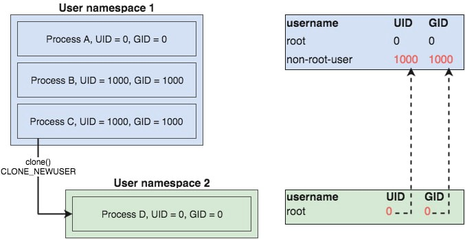

sample-container-runtime
========================

This is a simple container-runtime implemented for learning purposes.

**Stay tuned as this evolves!**

## Introduction to container technology

In general, a container is lightweight virtualization that, among others, allows to:
* run a process in separate, isolated sandbox (environment)
* have a separate filesystem mounted to a container
* isolate a container from the security perspective (allow/disallow system calls)
* limit the privileges of the process run in a container
* limit resources allocated for a container

Containers are based on following concepts:

* `namespaces` - Linux (or kernel) namespaces allows to create a new logical instances of an operating system's subsystems. Other definition says that "Linux namespace is a scoped view of your underlying Linux system".
As a result, the new instances are isolated from the OS they are running on and from the instances running in other namespaces.
There are following namespaces in Linux:
  * **UTS namespace** is about isolating hostnames. This namespace allows to set a different hostname for a container.
  * **MNT namespace** allows to mount a separate file system for a container.
  * **PID namespace** gives a container an isolated view on currently running Linux processes. As a result, a container will see only its own processes (processes of host OS will not be visible).
  * **IPC namespace** isolates an inter-process communication. It prevents processes in different namespaces from establishing [System V IPC objects](https://man7.org/linux/man-pages/man7/sysvipc.7.html)(Shared Memory, Semaphore and Message Queues) and (since Linux 2.6.30) [POSIX message queues](https://man7.org/linux/man-pages/man7/mq_overview.7.html) to communicate with each other.
  * **USER namespace** allows to create a separate, (usually) privileged user (technically it's a logical mapping of a user created in host OS, I will explain it later) within the namespace. Users configured in a host OS are not visible from a container.
  * **NET namespace** creates a logical instance of a Linux network stack. A container has its own list of network interfaces, routing table and iptables rules.
* `cgroups` and `setrlimit` - these both mechanisms are used to limit usage of resources (e.g. memory, disk I/O, CPU time) for a container.
* `root capabilities` - capabilities limits the privileges of root user of container.
* `Pivot_root` - the mechanism to change the root file system for a container.

Technically, a container is just a separate process, which is isolated from the host OS by using the concept of Linux namespaces.
Moreover, resources and privileges of this process are limited. All together creates the abstraction of a container.

## UTS namespace isolation

In case of UTS namespace it's all about passing a CLONE_NEWUTS to `Cloneflags` and invoking syscall.Sethostname() from within a child process.

The result can be tested by using hostname command from the container and outside the container:

```bash
# inside of container
$ ./build/pkg/cmd/sample-container-runtime/sample-container-runtime /bin/bash assets/busybox
uvNfXXCGtm # hostname
uvNfXXCGtm
uvNfXXCGtm # exit
exit
INFO[0002] container exit normally

# outside of container
$ hostname
vm-xxx
```

## MNT namespace isolation

Isolating container in the MNT namespace is a little bit more complex. First of all, we need to provide a new filesystem for the container. I recommend to use busybox root filesystem:

```bash
$ mkdir assets/busybox
$ tar -xf assets/busybox.tar -C assets/busybox
```

We will use busybox as a mount directory for the container.

In a child process the PivotRoot() function is called. This function is responsible for mounting <rootfs-dir> as a root filesystem for the container. In particular, it does following operations:

1. remounts current root filesystem with MS_PRIVATE
2. binds mount new root to itself
3. creates temporary directory, where the old root will be stored
4. [pivots root (swaps the mount at `/` with another (the `<rootfs-dir>` in this case).](https://lwn.net/Articles/689856/)

   pivot_root() changes the root directory and the current working
   directory of each process or thread in the same mount namespace to
   new_root if they point to the old root directory.  (See also NOTES.)
   On the other hand, pivot_root() does not change the caller's current
   working directory (unless it is on the old root directory), and thus
   it should be followed by a chdir("/") call.
   
   The following restrictions apply:
   -  new_root and put_old must be directories.
    
   -  new_root and put_old must not be on the same mount as the current
      root.

   -  put_old must be at or underneath new_root; that is, adding some
      nonnegative number of "/.." prefixes to the pathname pointed to by
      put_old must yield the same directory as new_root.

   -  new_root must be a path to a mount point, but can't be "/".  A
      path that is not already a mount point can be converted into one
      by bind mounting the path onto itself.

   -  The propagation type of the parent mount of new_root and the
      parent mount of the current root directory must not be MS_SHARED;
      similarly, if put_old is an existing mount point, its propagation
      type must not be MS_SHARED.  These restrictions ensure that
      pivot_root() never propagates any changes to another mount
      namespace.

   -  The current root directory must be a mount point.       
5. ensures current working directory is set to new root(os.Chdir("/"))
6. umounts and removes the old root

The implementation can be tested using `mount` command. From within the container it should show no mounts.

```bash
$ ./build/pkg/cmd/sample-container-runtime/sample-container-runtime /bin/sh assets/busybox
bdUcLVkPYF # env
SHLVL=1
PS1=bdUcLVkPYF #
PWD=/
bdUcLVkPYF # mount
mount: no /proc/mounts
bdUcLVkPYF # ls
bin    dev    etc    home   lib    lib64  root   tmp    usr    var
bdUcLVkPYF # hostname
bdUcLVkPYF
bdUcLVkPYF # exit
INFO[0011] container exit normally
```

## PID namespace isolation

If we would run `sample-container-runtime` and invoke `ps aux` command we would see:

```bash
ODoTeVpuuc # ps aux
PID   USER     TIME  COMMAND
# empty!!!
```

This is because we have mounted a new file system with an empty `/proc` directory. Linux uses `/proc` directory to store
information about all processes running in the system. As the `/proc` is empty, we cannot see any process.

To fix that, we need to prepare `/proc` filesystem before running the process inside the container.

Firstly, I will create a new (PID) namespace by passing additional flag (`CLONE_NEWPID`) to the `Cloneflags`.

Then, the `/proc` file system needs to be prepared for a child process. This is done in `ProcPrepare()` function. This function
creates a new `/proc` directory in the container's file system which has just been mounted. Additionally, it mounts the `proc` mount
of a parent process to the `/proc` of the container. The `proc` mount exists on the list returned by `mount` command invoked from a host system:

```bash
$ mount|grep proc
proc on /proc type proc (rw,relatime)
...
```

As the container is running inside a PID namespace, it will have an access only to processes belonging to it. Now, the output of `ps aux` from
within a container looks as follows:

```bash
$ ./build/pkg/cmd/sample-container-runtime/sample-container-runtime /bin/sh assets/busybox
ODoTeVpuuc # mount
rootfs on / type rootfs (rw)
/dev/vda1 on / type ext4 (rw,noatime,data=ordered)
proc on /proc type proc (rw,relatime)
ODoTeVpuuc # ps -ef
PID   USER     TIME   COMMAND
    1 root       0:00 {exe} nsInit assets/busybox /bin/sh
    7 root       0:00 /bin/sh
    9 root       0:00 ps -ef
ODoTeVpuuc # exit
INFO[0013] container exit normally
```

## IPC namespace

>> Each IPC namespace has its own set of System V IPC identifiers and
   its own POSIX message queue filesystem.  Objects created in an IPC
   namespace are visible to all other processes that are members of that
   namespace, but are not visible to processes in other IPC namespaces.

Adding the IPC namespace is as simple as appending the new flag (CLONE_NEWIPC) to the `Cloneflags`.

To verify whether container has been isolated in the IPC namespace run following commands:

```bash
# inside of container
$ ./build/pkg/cmd/sample-container-runtime/sample-container-runtime /bin/sh assets/busybox
gyZQRmcHMr # ipcs -a

------ Shared Memory Segments --------
key        shmid      owner      perms      bytes      nattch     status      

------ Semaphore Arrays --------
key        semid      owner      perms      nsems     

------ Message Queues --------
key        msqid      owner      perms      used-bytes   messages
gyZQRmcHMr # readlink /proc/$$/ns/ipc
ipc:[4026532515]

# outside of container
$ ipcs -a

------ Message Queues --------
key        msqid      owner      perms      used-bytes   messages    
0x11df483b 0          root       644        0            0           
0x98665985 32769      root       644        0            0           

------ Shared Memory Segments --------
key        shmid      owner      perms      bytes      nattch     status      
0x00005feb 0          root       666        12000      3                       
0x00005fe7 32769      root       666        524288     2                       
...                     

------ Semaphore Arrays --------
key        semid      owner      perms      nsems     
0x00008708 0          root       666        1         
0x000086f8 229377     root       666        1         
...
$ readlink /proc/$$/ns/ipc
ipc:[4026531839]
```

## [User namespace](https://medium.com/@teddyking/namespaces-in-go-user-a54ef9476f2a)

USER namespaces are a little bit more complex than the previous namespaces I've implemented.
Hence, I encourage every reader to familiarize themselves with following two articles about USER namespaces:

https://lwn.net/Articles/532593/

https://lwn.net/Articles/540087/

In general, USER namespace allows to map a process's user and group IDs within the namespace with its IDS outside the namespace.
Thus, a process can be privileged to make some operations inside the namespace, but it would not be allowed to perform the same operations
outside the namespace.

To isolate a container (process) in a USER namespace properly there need to be a mapping from the user IDs (and group IDs also)
inside a USER namespace to a corresponding set of user IDs outside the namespace. Otherwise, the system calls returning user and group IDs
(wrapped by `getuid()` and `getgid()`) return the value defined in the file `/proc/sys/kernel/overflowuid` for user ID and
`/proc/sys/kernel/overflowgid` for group ID (normally these values equal to 65534).

To make things working a `uid` and `gid` mapping has to be configured.

Every process stores a `uid` and `gid` mapping information in the file `/proc/PID/uid_map` and `/proc/PID/gid_map`, respectively.

These files must be properly configured to provide a mapping. As these files are owned by the user ID that created the namespace, it is
the only user (except for root), who is allowed to write to these files.



## Refs

* [Code to accompany the "Namespaces in Go" series of articles](https://github.com/teddyking/ns-process)
* [Linux containers in 500 lines of code](https://blog.lizzie.io/linux-containers-in-500-loc.html)
* [Whitepaper - Understanding and hardening Linux Containers](https://github.com/osinstom/containers-impl-c)
* [Build Your Own Container Using Less than 100 Lines of Go](https://www.infoq.com/articles/build-a-container-golang/)
* [containers-impl-c](https://github.com/osinstom/containers-impl-c)
* [A deep dive into Linux namespaces, part 3](http://ifeanyi.co/posts/linux-namespaces-part-3/#pid-namespaces)
* [Namespaces in operation, part 7: Network namespaces](https://lwn.net/Articles/580893/)
* [Introducing Linux Network Namespaces](https://blog.scottlowe.org/2013/09/04/introducing-linux-network-namespaces/)
* [Run a command in unique namespaces](https://github.com/iffyio/isolate)
* [Mount namespaces and shared subtrees - LWN article](https://lwn.net/Articles/689856/)
* [Golang+shell](https://zhuanlan.zhihu.com/p/95590072)
* [Linux Namespace : IPC](https://www.cnblogs.com/sparkdev/p/9400673.html)
* [Pipes 101 with Go](http://www.albertoleal.me/posts/golang-pipes.html)
* [mydocker](https://github.com/xianlubird/mydocker)